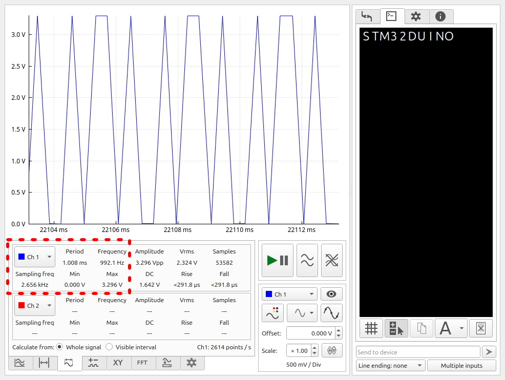
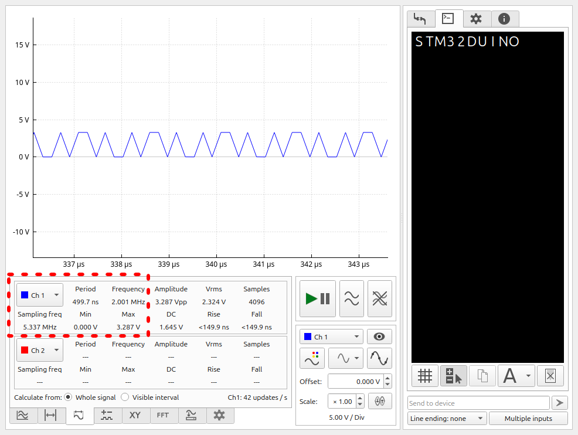

# Intro
The goal of this example is to create a single channel "oscilloscope". \
This can be achieved with the use of DataPlotter.\
We will generate an example signal using a PWM pin, then sample it with\
ADC, and send data over Serial to a connected computer running DataPlotter. \
The data will then be transformed into a voltage over time plot, which we can \
analyze, for ex. using FFT.

D12 will be used as the PWM output, A1 as the ADC input.
D12 is connected to A1 directly, and to GND through a 10kOhm resistor.

# Basic
This can be easily achieved using simple arduino-core code.

@@include|basic/basic.ino|all|//||C|

## Results

Sampling Freq: 2.66KHz (According to DataPlotter) \
PWM frequency can be accurately measured up to ~1.3KHz using FFT in DataPlotter

analogRead initiates a one-off conversion every time we call to it. \
This is rather slow, but the resulting data is nonetheless sufficient \
for plotting low-frequency signals.

# Advanced
In order to increase sampling speed, we will need to optimize the sampling functions of our code.

## Setup
By adding a build_opt.h file to the sketch folder, we can customize build options for the arduino core. \
In this case, we will disable arduino's ADC module completely, as we do not need the options \
it provides.

@@include|advanced/build_opt.h|all|//||C|

We will set up the ADC to continuously sample CH1. We can then read the ADC data register at any time to \
get the last sampled value.

We will also set up the RCC to provide the highest possible core clock of 64mHz.

These init functions can be generated using CubeMX.

@@include|advanced/advanced.ino|all|//||C|

## Results

Sampling Freq: 7.5KHz (~2.8 times increase from basic arduino code) \
PWM frequency can be accurately measured up to ~3KHz using FFT in DataPlotter

Letting the ADC peripheral sample in the background while the core is doing communications
allows for far greater throughput.

# Advanced with DMA

So far, we have been sending data points one-by-one to the plotter. This is inefficient, as besides the data point, we have to send the time at which the point was measured, as well as a lot of formatting bytes. Additionally, while we are sending the collected data, ADC continues collecting in the background, so we are not sending every sample collected.

The ADC is currently configured to sample every 1.5 clock cycles, which is further divided by 2 by the clock prescaler. It is not feasable to send the data point-by-point in the 3 cycle window.

We can remedy this by collecting the ADC data in a buffer, and then sending that complete buffer to DataPlotter. DataPlotter provides a function for us to import a whole channel with data - $$C.

Unfortunately, the data that we send will not be appended to the data sent previously, as with the point-by-point mode. However, we can capture a (relatively) high-frequency sample window, and display that. This can be used, to plot a short, but high resolution graph.

## Setup
We will set up Direct Memory Access from the ADC to a buffer array. Each time ADC completes a conversion, the data register will be copied over by DMA to the array, and the memory address of the destination will be incremented by the data-width of the sample.

The DMA will operate in circular mode once it is set up. When the buffer is full, the DMA will generate an interrupt, which will allow us to disable further DMA transfer, write the buffer data over serial, and re-enable transfer again. According to the application needs, this can instead be setup to instead only fill up the buffer for ex. when an external event is triggered, such as a button press or a signal on ADC.

The G031K8 provides us with a rather limited 8k of RAM. In order to maximize the size of the buffer, we can drop the ADC sampling resolution down to 8 bits, meaning that each sample is contained within a byte of memory. It's possible to handle a buffer of 4k without overflowing the RAM. This can be marginally increased by further stripping down arduino code, but this is outside the scope of this example and the increase wouldn't be large either.
 
The code is mostly the same, except that we will also change the prescaler for the ADC to 1 maximize the sampling speed. A speed change of 1.5 to 3.5 cycles is also required for the channel, as on 1.5 it seems that the data is actually generated faster than it can be sent, and serial communication never completes. This can be remedied by writing our own u(s)art code, but this is outside the scope of this example.

@@include|advanced_ch/build_opt.h|all|//||C|
@@include|advanced_ch/advanced_ch.ino|all|//||C| 

## Results 

Sampling Freq: 5.337MHz (~702 times increase from the advanced code, ~2052 times increase from the arduino code) \
PWM frequency can be accurately measured up to ~2.5MHz using FFT in DataPlotter

Saving the sampled data continously to a buffer without interrupting it every conversion or without waiting for the data to be sent point-by-point yields a massive increase in sampling speed.

# Conclusion
Accessing the HAL directly instead of using bulky arduino-core code leads to great performance gains.
etc. etc.

