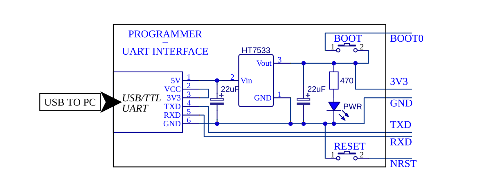
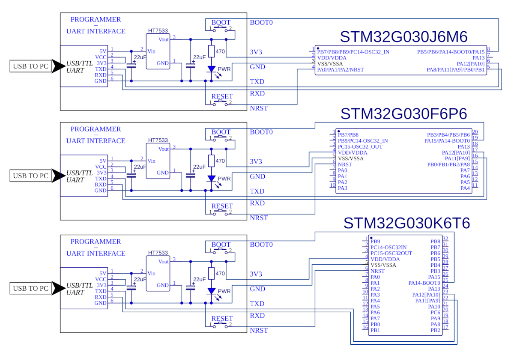
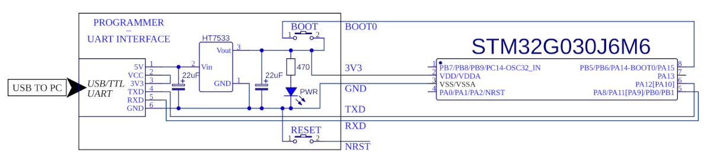
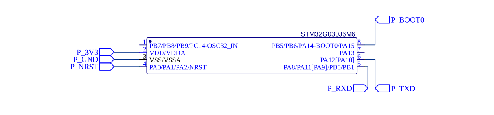
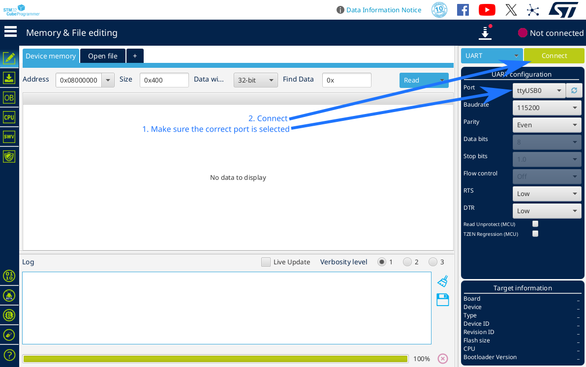
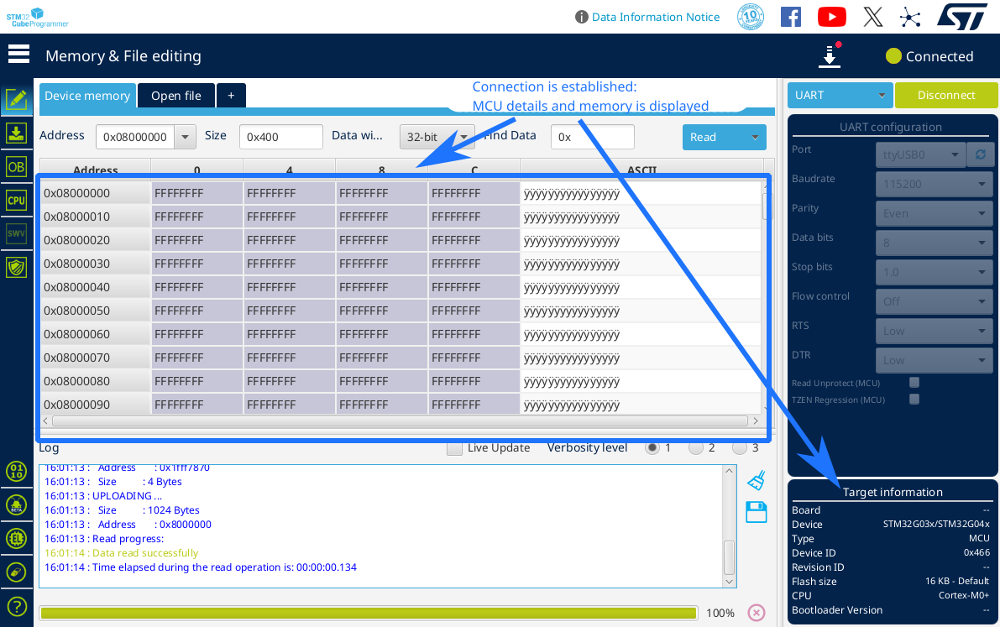
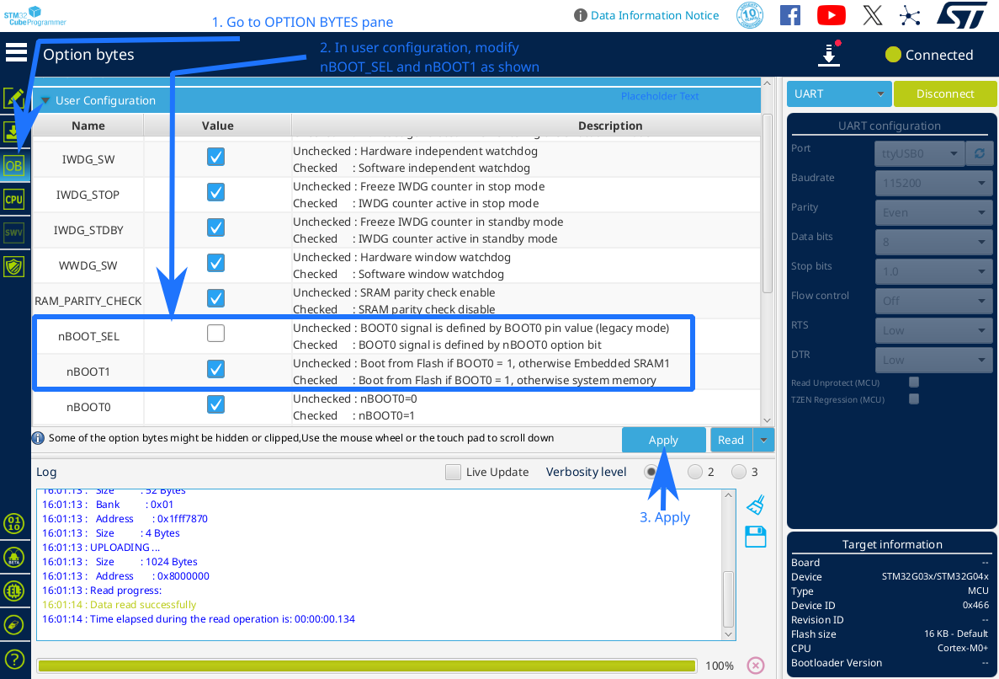

# Introduction

We use the STM32G030 MCU family, primarily MCUs packaged in SO-8, TSSOP-20 and LQFP-32 (STM32G030Jxxx, STM32G030Fxxx and STM32G030Kxxx respectively).
For programming and powering the MCUs, a USB to TTL UART module is used. It outputs USB 5V, as well as exposes a USART interface to the programming device (PC).

The following circuit is used as a programming module:

# Circuits

The following circuits are used for the three packages previously mentioned:

The same pins are used in every instance, meaning that the compiled code is cross-compatible with the three packages, with the one caveat being that on the SO-8 package (STM32G030Jxxx), the NRST pin is shared with other GPIO pins.

Since the pin count is very limited on the SO-8 package, in some examples where it is utilised, the NRST pin will not be configured or connected to the programmer. 
In this configuration, to reset the MCU, the USB to TTL UART module is simply unplugged and plugged back in to the host PC, power cycling the chip.

In further examples, the programmer circuit stays exactly the same. To avoid repetition in the circuits, it will be omitted, and instead the following net labels will be used to denote connections to the programmer: (P_3V3, P_GND, P_NRST, P_BOOT0, P_TXD, P_RXD):

# Virgin programming

In order to program STM32G030 through the UART interface, the MCU must be started in the integrated bootloader mode, which provides the ability to perform programming tasks over UART. After programming is done, the MCU is reset and goes into executing from FLASH, no longer allowing programming.
This configuration does not allow for native debug, but since the UART interface is exposed to the host PC, serial communication will be used to print debug info.

On previously non-programmed MCUs, system memory boot mode is selected automatically upon start up.

After assembling the circuit on a breadboard, it is ready to be programmed. The USB to TTL UART module is plugged into the host PC, and the PWR LED lights up.

In order to ensure the ability to enter system memory boot mode after the MCU has been programmed, certain option-bytes must be set through the programming interface.
This can be achieved using the STM32CubeProgrammer tool.

STM32CubeProgrammer interface:

Connected to the MCU:

Option bytes setting:

**Make sure to keep the BOOT button held when hitting apply, as the programmer attempts to reconnect to the MCU after programming the option bytes, and for this, the system memory boot mode must be entered upon reset. Programming will be complete either way, but the program will display errors if it isn't able to reconnect.**

**Ensure the option bytes are set correctly beofre hitting apply. An incorrect setting, for example unchecking nBOOT1, will lock the MCU out of entering system memory boot mode, meaning it can't be programmed with our circuit anymore - a condition that can only be undone using an actual in-circuit programmer, such as an ST-LINK**

After the option bytes are written, the MCU is setup correctly for our intended mode of operation.

# MCU programming

With the option bytes set, the MCU will decide whether to enter system memory boot mode, or to boot from flash, depending on the state of the BOOT0 pin upon power-on. In order to enter system memory boot mode, the BOOT button must be held on the programmer during power-on. 

If the MCU has the NRST pin connected to the programmer, the following sequence is used to enter "programming mode":
1. Hold BOOT button
2. Hold RESET button
3. Release RESET button
4. Release BOOT button

If the NRST pin is not configured, the following sequence is used:
1. Hold BOOT button
2. Unplug USB to TTL UART module
2. Plug in USB to TTL UART module
4. Release BOOT button

After the appropriate sequence is followed, system memory boot mode is entered on a previously-programmed MCU. This can most easily be identified by the ability to connect to the MCU from STM32CubeProgrammer.

After programming the MCU through STM32Duino, the system memory boot mode is automatically exited, and the MCU boots into main flash, where user code is stored. To re-program the chip, a sequence to enter the system memory boot mode must be performed again, after which the MCU is available to be programmed once more.
