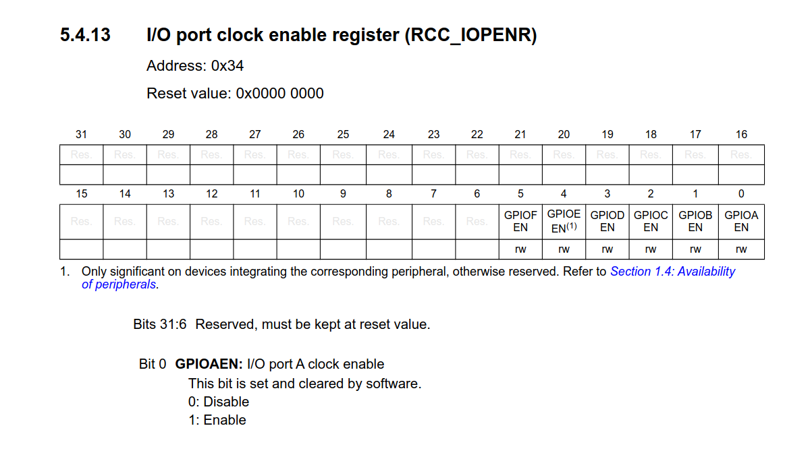

# GPIO
The goal of this example is to showcase how GPIO pin functions can be defined through arduino code and through register configuration.

## Basic
We can start with a basic arduino sketch.

We will need to configure PA_11 & PA_12 to have internal pullup resistors to prevent the pins from floating when they are not connected to GND through the pushbutton.
In this configuration, the state of the pin will be inverse to the state of the button (pressed = 0, released = 1)

@@include|basic/basic.ino|all|//||C|

The above example allows us to push the button to activate the board's built-in LED.

## Writing and reading with direct register access
The reference manual of the MCU installed on the board provides all the info that is required for configuring/operating GPIO: \
[STM32G0x1 reference manual on st.com](https://www.st.com/resource/en/reference_manual/rm0444-stm32g0x1-advanced-armbased-32bit-mcus-stmicroelectronics.pdf)

The STM32 GPIO peripheral directly exposes the input and output data registers to the SW:

Reading from the GPIOx_IDR register will give us the state of all the port's inputs in a 32 bit unsigned integer (of which only the bottom 16 bits will have meaning, as the ports only have 16 pins).
Writing, in turn, to the GPIOx_ODR register will directly influence the pin's output states (LOW = 0, HIGH = 1)

Importantly, reading and writing are operations done on a whole unsigned integer, meaning that the MCU executes them in a single instruction. This is more efficient than getting/setting the pins' values one-by-one.

We want to put the values of GPIOx_IDR ID[13] and ID[14] into GPIOx_ODR OD[11] and OD[12] respectively. Let's have a look at the manipulations required to do so:

1. `GPIOA->IDR >> 13` returns the value of the GPIOA_IDR register, bit-shifted to the right by 13, meaning that bits 0 and 1 of the value are bits 13 and 14 of the original register.
2. `(GPIOA->IDR >> 13) & 0b11` isolates the lowest 2 bits of the value, leaving all other bits as 0 (this should not affect this example, but if you have other pins configured for other reasons, this is necessary to avoid modifying other pin states.) 
3. `((GPIOA->IDR >> 13) & 0b11) << 11` shifts the value 11 bits to the left. The original bits 13 and 14 get moved to positions 0 and 1, and then back to 11 and 12. All other bits of this value are zero. This is what we will be writing to the GPIOA_ODR register.

@@include|basic_odr_idr/basic_odr_idr.ino|all|//||C|

The same result is achieved as with the basic example - the button states are reflected on the output LED's.

## Efficiently configuring more pins

STM32duino's `pinMode()` function does a few things:
1. Get the pin's GPIO port X and pin number N (PX_N)
2. Enable GPIO port X's clock
3. Set the GPIO port speed
4. For certain MCU families, handle alternative pin functions
5. Appropriately modify the port's pin mode register
6. Appropriately modify the port's pullup register

And does so every time the function is called.

However, things like enabling the port's clock/setting it's speed only have to be done once. 
So, if we wished to simplify compiled code, we could omit calling `pinMode()` and instead configure pins through their registers all at once.

Let's look at the registers required to accomplish this:

For our simple mode of operation, it is sufficient to:
1. Enable the GPIOA port clock (setting bit 0 of RCC_IOPENR)
2. Configure GPIOA_MODER    
3. Configure GPIOA_PUPDR

Let's take a look at what value written to GPIOA_MODER will achieve the outlined configuration:
- MODE[11] is 01 (OUTPUT)
- MODE[12] is 01 (OUTPUT)
- MODE[13] is 00 (INPUT)
- MODE[14] is 00 (INPUT)

The rest of the bits aren't important in this example and will be left at their reset values.
Since the register initializes to 0xFFFFFFFF (all ones), we just need to reset the necessary bits with a single write:
`GPIOA->MODER &= ~(0b11111010 << 2 * 11);` 

@@include|advanced/advanced.ino|all|//||C|

The same result is achieved as the original code, except every port access relates to multiple pins at once, which in this simple example potentially doubles execution speed.

And so, without using any costly Arduino functions, we can now manipulate GPIO pins through direct register access.