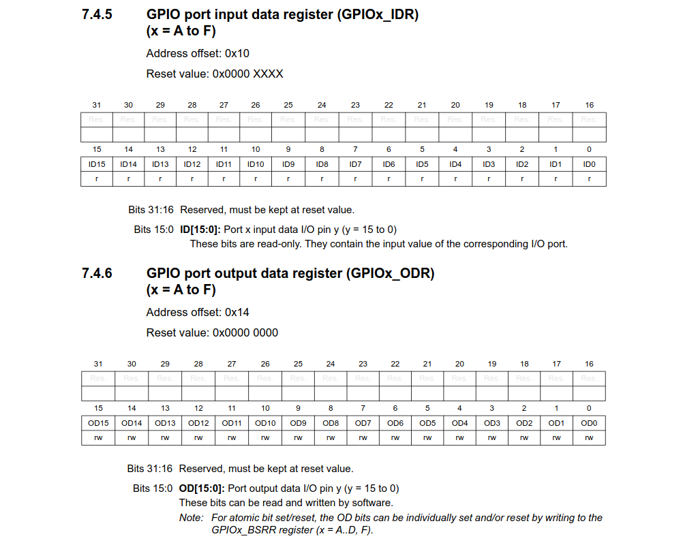

## Configuring multiple pins at once

To further simplify program operation, we can omit Arduino's config functions entirely and write more efficient code that doesn't modify every pin's configuration one by one...

We can skip/combine multiple steps of the `pinMode()` function. The first necessity for operating GPIO is enabling relevant port clocks.

Then, using the afforementioned GPIOx_MODER and GPIOx_PUPDR register, we configure the pin's operating modes.

See code comments for the full description of the configuration sequence.

@@include|advanced/advanced.ino|all|//||C|

Note that multiple pins (e.g. PB_4 and PB_5) were configured with a single register access.

Arduino is just an abstraction layer, so despite not going through Arduino's functions to configure the pins, we can still use Arduino's Read/Write to access and modify the pins state.

## Reading and Writing multiple pins at once

Alas, Arduino's `digitalRead()` and `digitalWrite()` are also complicated functions that have to, for example, perform translations from pin mappings, and can only access one pin's state at a time.

To read and write GPIO pins it is sufficient to access the ports input and output data registers (IDR and ODR respectively):

@@include|advanced_reading/advanced_reading.ino|all|//||C|

We read the whole register content at once, avoiding multiple repeated accesses to it that would be generated by multiple calls to `digitalRead()`. This has a big performance impact, and allows easy transfer of the port's state as an integer value, which can then be bit-masked to read individual pins.

Then, we can simply replace `digitalWrite()` with direct manipulation of port C's output data register.

@@include|advanced_writing/advanced_writing.ino|all|//||C|
