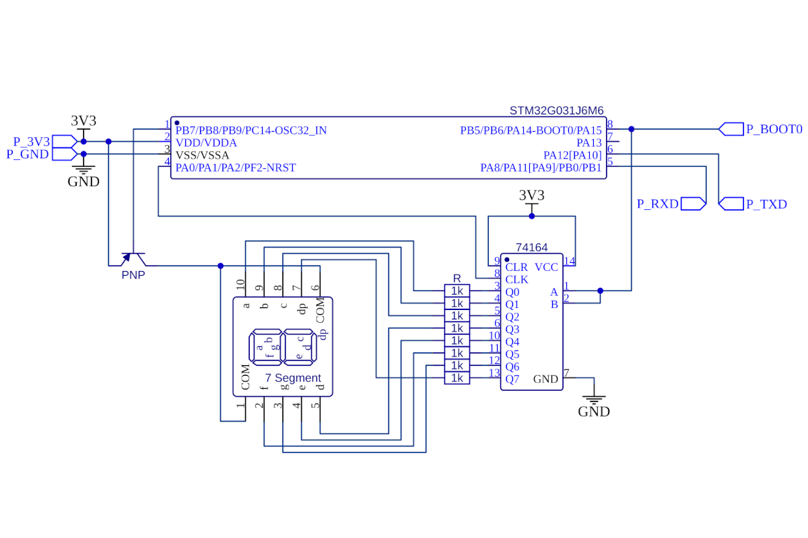
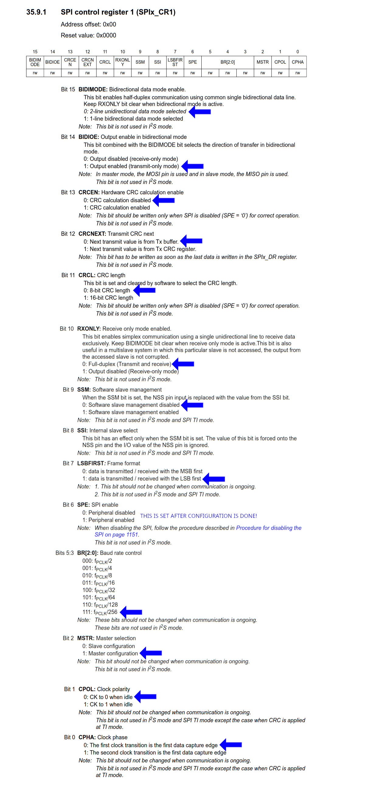
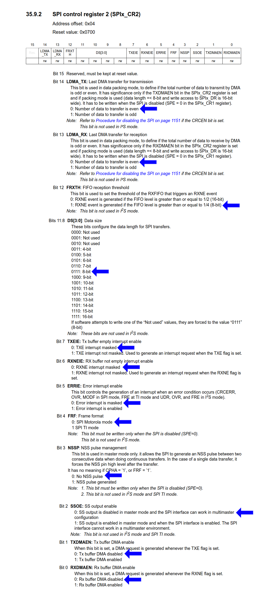

# SPI Part 1: Transmit-Only master

Let's take a look at the following schematic:



#TODO: UPDATE ALL CODE TO REFLECT SCHEMATIC

On each rising edge, the shift register samples the inputs `AND(A, B)` and puts the value into `Q1`. The value of the rest of `Qx` is put into `Qx+1`.

The two inputs act as a kind of chip-enable signal: when one is low, the other one's state will be ignored and 0s are put into the outputs. This is not important right now, as we only have one device, but will become more relevant in following examples.

## Basic
Here is the basic code that will operate the chip and shift out the required values to operate the 7-segment display by "bit-banging" gpio pins:

@@include|basic/basic.ino|all|//||C++|

The numbers 0-9 consequently show up on the seven segment display, and are held on it for a second each.

With this code the MCU uses cycles to directly operate the connected pins to send the data to the shift register. When delays are encountered, necessary for the timings to be tolerated by the shift register, the MCU can not do anything else. This is perfectly fine for this basic example, but in a more complex application, other processing may need to be done, and will be slowed down by communicating with the shift register.

## The SPI peripheral, Arduino style
The STM32 feature a SPI peripheral, which can take the work of communicating with the external chip away from the MCU, allowing it to do other computations while communication occurs.

The STM32Duino core exposes this peripheral through the `SPIClass`

@@include|basic_peripheral/basic_peripheral.ino|all|//||C++|

For the SPI peripheral to perform the transfer, the MCU simply loads the value desired to be transferred into the relevant register, and the rest of the communication occurs on the peripheral's side, freeing up the MCU to do anything else the application may require it to do.

As no other operations are required in this example, the transfer actually happens in blocking mode, where the MCU waits for it to complete before continuing. In a more complex application, the MCU could wait for an interrupt from SPI, indicating transfer complete, or offload the data transfer to DMA, etc. but this is beyound the scope of this example.

## The SPI peripheral, Direct register access style

To directly access the SPI peripheral without using the arduino core, it has to be configured first:

1. The relevant GPIO ports must have their clocks enabled
2. The relevant GPIO pins must be configured in alternate function mode
3. The SPI peripheral must be configured
4. The SPI peripheral must be enabled.

We already know how to set-up the GPIO, so let's focus on the SPI peripheral:
It is configured through the SPIx_CR1 and SPIx_CR2 registers. The selected options are highlighted with arrows:




This setup yields the following constants required to be written into SPI1_CR1 and SPI1_CR2 respectively:
``` C++
SPI1->CR1 = 0b0000001110111100;
SPI1->CR2 = 0b10111  << 8;
```

After configuration is written, bit 6 of SPI1_CR1 can be set to enable the peripheral. SPI1 is operational.

To begin a transfer, 8 bits of data must be written to SPI1_DR. SPI1 begins the transfer immediately after the write access, and sets the BSY bit in SPI1_SR.

@@include|advanced/advanced.ino|all|//||C++|

As such, the burden of handling communication with the external chip is offloaded to the integrated periphery of the MCU.