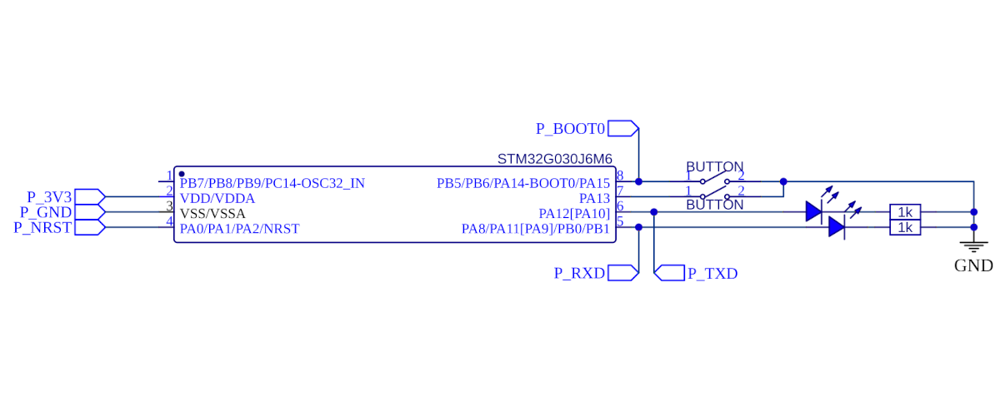

# Intro

The schematic from the GPIO example is reused. This time around, the LEDs will display activity on the UART tx and rx lines, and the buttons are used as inputs.

#TODO: Describe code

@@include|basic/basic.ino|all|//||C++|

@@include|echo/echo.ino|all|//||C++|

@@include|buttonbuffer/buttonbuffer.ino|all|//||C++|